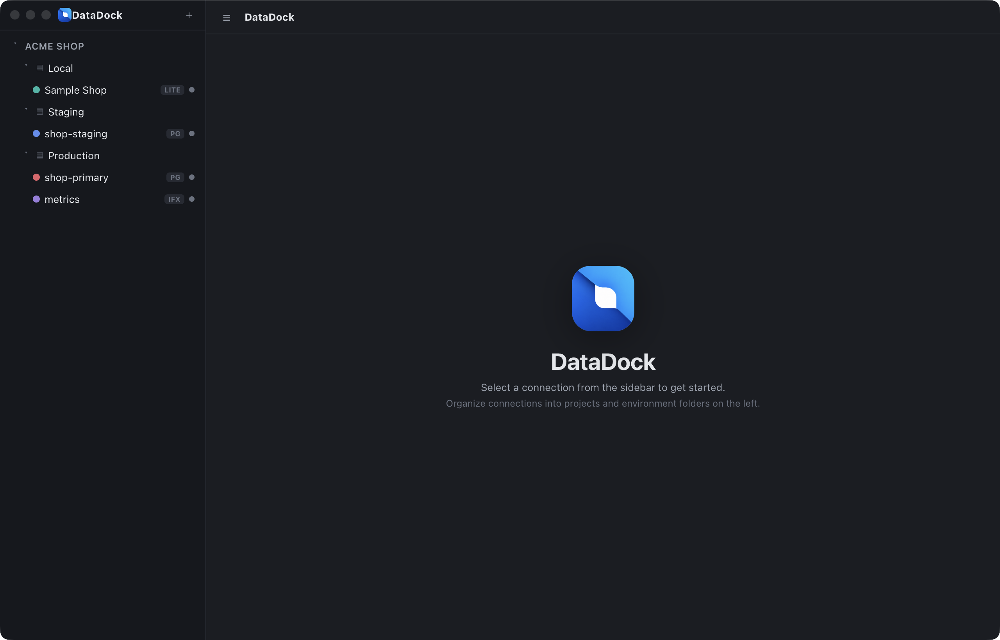
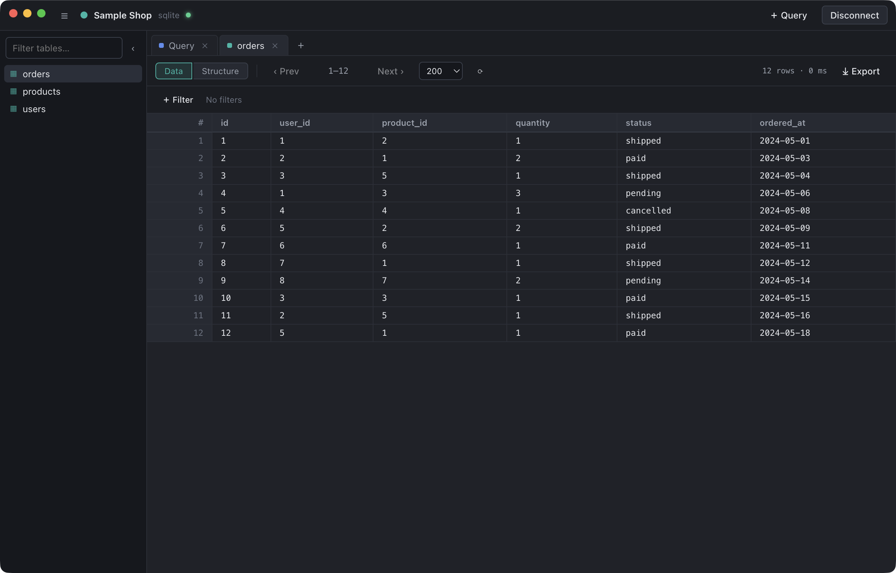
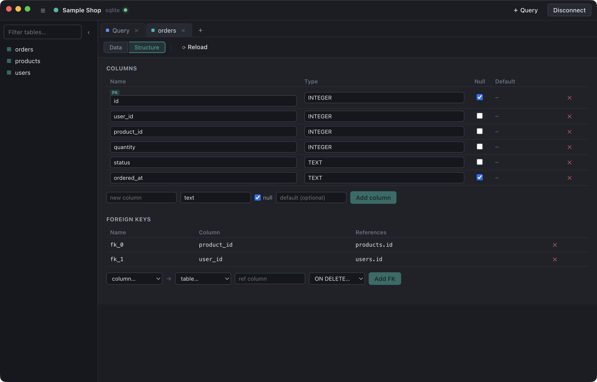
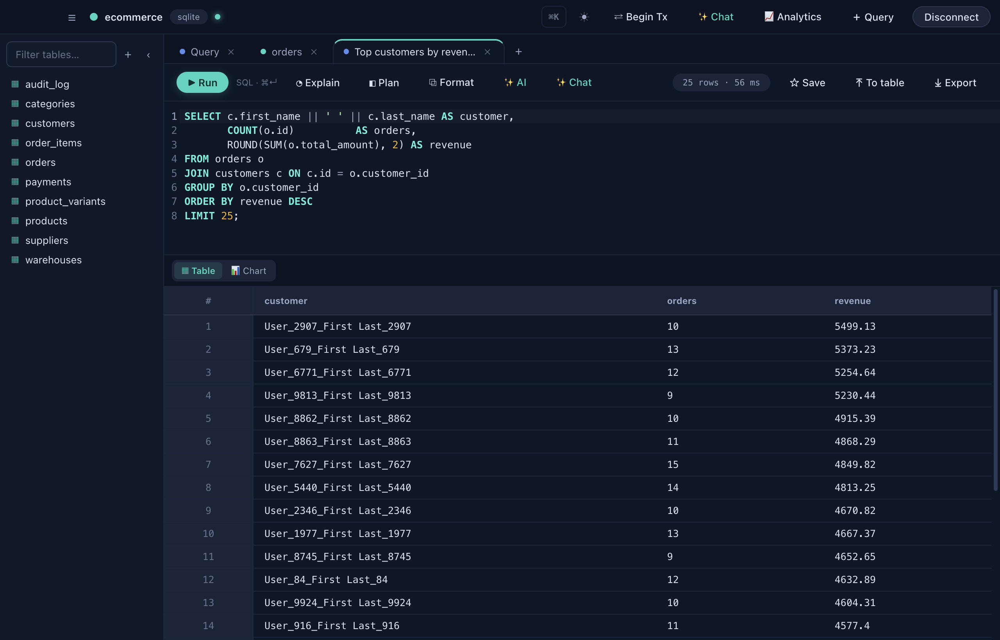
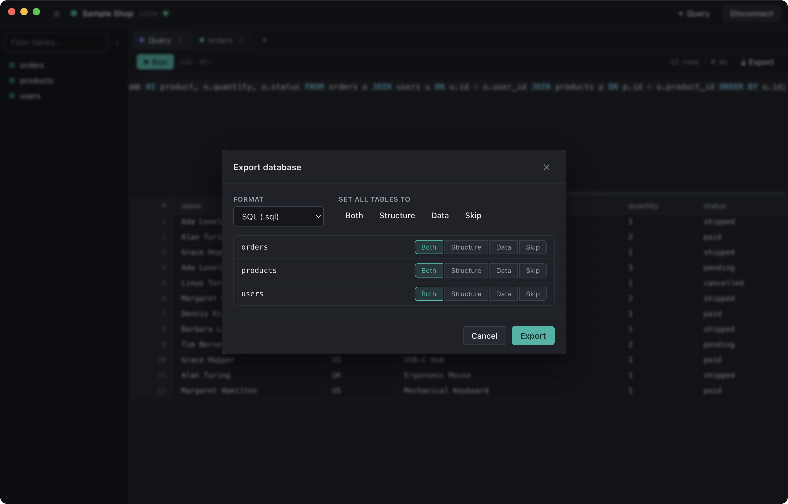
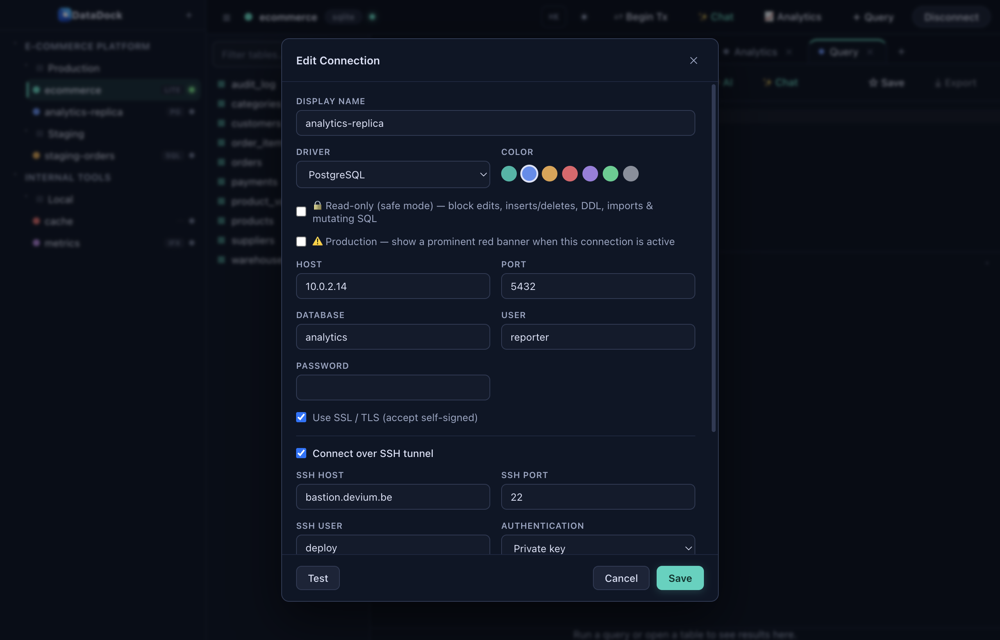
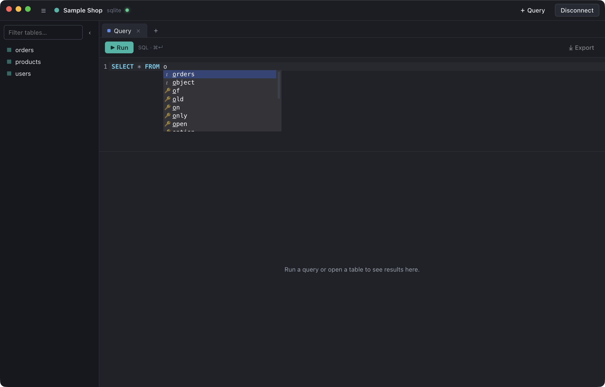

<div align="center">


# DataDock

### The database client that finally organizes itself the way *you* think.

**Projects → Environments → Connections.** One clean desktop app for PostgreSQL, MySQL, SQLite, SQL Server, MongoDB, Redis and InfluxDB — with browsing, editing, structure changes, import/export, SSH tunneling, ER diagrams, a realtime Redis queue viewer and a command palette built in.

<br/>


<sub>A free product by <a href="https://devium.be/"><b>Devium</b></a> — made with care, given away for nothing.</sub>

</div>

<br/>

<p align="center">
  
</p>

---

## Why DataDock?

Most database clients dump every connection into one flat, unsearchable list. If you juggle a handful of projects — each with **local**, **staging** and **production** databases — that list becomes a guessing game.

DataDock fixes the part that actually slows you down: **organization.**

```
📁 Acme Shop
 ├─ 🗂  Local
 │   └─ ● Sample Shop        (SQLite)
 ├─ 🗂  Staging
 │   └─ ● shop-staging       (PostgreSQL)
 └─ 🗂  Production
     ├─ ● shop-primary       (PostgreSQL over SSH)
     ├─ ● metrics            (InfluxDB)
     └─ ● jobs & cache       (Redis)
```

Click your way down — **project → environment → connection** — and you're in. No more `prod_db_2_FINAL_v3` in a sea of saved connections.

---

## ✨ Features

Everything here ships **today**. Scan the table for the lay of the land, then expand the section below for the full detail.

| | Area | What you get |
|:--:|---|---|
| 🗄️ | **Organized connections** | Projects → environment folders → connections — color-coded, encrypted at rest, shareable, with a read-only safe mode |
| 🔌 | **Seven engines** | PostgreSQL · MySQL / MariaDB · SQLite · SQL Server · MongoDB · Redis · InfluxDB |
| 📨 | **Redis & live queues** | Browse keys by prefix, inspect any value type, run commands — plus a realtime, framework-agnostic queue dashboard (Laravel/Horizon · BullMQ · Sidekiq · RQ · Celery) |
| 🔐 | **SSH tunneling** | Reach databases behind a bastion via private key, password or agent |
| 📊 | **Spreadsheet-style editing** | Paginate, sort, filter, inline- and bulk-edit — every change committed in a transaction |
| 🔗 | **Visual exploration** | Click-through foreign keys, a record Explorer, a related-records overview, an interactive ER diagram and a dependency map |
| 🧱 | **Structure editor** | Create / drop tables and edit columns, types, foreign keys & indexes — no hand-written DDL |
| ⌨️ | **Query, your way** | Multi-tab editor, schema-aware autocomplete, history, snippets, variables, formatter & EXPLAIN |
| ✨ | **Built-in AI** | NL → SQL, explain, fix-with-AI and chat-with-your-data — Claude, Gemini, Mistral, Grok or Ollama |
| 📈 | **Analytics** | A dedicated analytics area — datasets, a no-SQL chart builder, KPI cards, reusable saved metrics, drag-and-drop resizable dashboards with **filters · drill-through · realtime refresh · PDF/Excel export**, and an AI that builds *and edits* them from a plain-English prompt |
| 📈 | **Performance & insights** | Slow-query dashboard, index hints, pool diagnostics, table sizes & column search |
| 📦 | **Import & export** | CSV · Excel · JSON · SQL · zipped whole-DB dumps · result → new table |
| 🎭 | **Data masking** | Anonymize chosen columns with realistic fake data on export — safely copy production into a local database |
| 🛠️ | **Server tools** | Databases, users & roles and a process list (with kill) |
| 🎨 | **Comfortable to live in** | Dark / light themes, a ⌘K command palette and collapsible panels |

<details>
<summary><b>📖 Expand for the full feature tour</b></summary>
<br>

#### 🗄️ Organized connections
- **Projects → Environment folders → Connections** — a real hierarchy, not a flat list.
- Color-coded connections with live status dots (connecting / connected / error).
- **Duplicate a connection** in one click — useful for cloning a staging config to try against prod.
- Credentials **encrypted at rest** with the OS keychain (Electron `safeStorage`) — never stored in plain text.
- **Read-only "safe mode"** per connection — guard production by blocking edits, inserts/deletes, DDL, imports and mutating SQL, with a clear 🔒 badge.
- **Share connections** — export your project/environment/connection tree to JSON (secrets stripped) and import it on another machine.

#### 🔌 Multi-engine
- **PostgreSQL · MySQL / MariaDB · SQLite · Microsoft SQL Server · MongoDB · Redis · InfluxDB** — all from one app.
- **MongoDB** — browse collections like tables, run shell-style queries (`db.users.find({ active: true }).sort({ name: 1 }).limit(50)`, `.aggregate([…])`, `.countDocuments(…)`), edit documents inline, and get collection/field autocomplete. Documents are flattened to columns with nested values shown as JSON.
- **Redis** — keys are grouped **by prefix into pseudo-tables** (`user:1`, `user:2` → *user*), shown with type / TTL / size / value. **View any value type** (string · hash · list · set · zset · stream), **run raw commands** in the editor (`HGETALL user:1`, `LRANGE queues:default 0 10`), edit string values & TTLs, delete keys, and inspect connected clients via the Process List. Plus a **realtime queue viewer** (see below).

#### 🔐 SSH tunneling
- Reach databases that only live behind a bastion: **connect via SSH (private key, password, or agent), then to the DB** — exactly how you'd hit a prod/staging box.

#### 📊 Browse & edit data like a spreadsheet
- Fast result grid with **pagination, sorting and column filters**.
- **Double-click any cell to edit**, or pop open the **row detail panel** on the side.
- Stack up changes across many rows and **commit them all at once with ⌘S** — every batch runs in a transaction.
- **Bulk edit** — tick rows with the checkbox column (or select-all), then set a column to one value (or NULL) across the whole selection in a single staged, undoable change.
- **Generate SQL from a selection** — turn the ticked rows into `INSERT` or `UPDATE` statements (PK-keyed) dropped straight into a new query tab.

#### 🧱 Visual structure editor
- **Create new tables** (define columns inline) and **drop tables** — multi-select in the list, with *Ignore foreign-key checks* and *Cascade* options.
- Add / rename / drop **columns**, change types and nullability, manage **foreign keys** and **indexes** — no hand-written DDL.

#### 🔗 ER Diagram & schema visualization
- Open the **ER Diagram tab** from the menu (or `⌘K` → *ER Diagram*) to get an interactive visual map of every table, column, primary key and foreign-key relationship in your schema.
- **Dependency explorer** — right-click any table → *Dependencies…* to see exactly what it **references** and what **references it** (the foreign keys that block a drop), and click through to any related table.
- **Hierarchical layout** — parent tables (referenced by FK) appear above their dependent children, organized into clean labelled rows. **Re-layout** button resets everything back to the hierarchy at any time.
- **Drag** any table card to rearrange freely after the initial layout.
- **⊞ Fit** scales and scrolls the view so the whole diagram is visible at once.
- **Zoom in / out** with `⌘ +` / `⌘ −`, `⌘`-scroll the mouse wheel, trackpad pinch, or the toolbar `−` / `＋` buttons. Range: 15 % – 300 %. The zoom percentage is always shown and clicking it resets to 100 %.
- PK and FK column badges; smooth Bézier edges connect related tables with smart top/bottom routing for vertically stacked cards.

#### ⚙️ Settings (⌘,)
- **AI Providers** — add keys for Anthropic, Google, Mistral or xAI (Grok), or point at a local **Ollama** server (no key needed); pick the active provider and model, and **Test** the connection.
- **Appearance** — interface scale (zoom), light/dark theme, comfortable/compact row density, and the default page size.
- **About** — a little love from [Devium](https://devium.be/): built with a smile for everybody. 🙂

#### 🎨 Comfortable to live in
- **Dark and light themes**, remembered between sessions.
- **Automatic updates** — DataDock checks GitHub Releases on launch; when a newer version is out you get a *"New version — Update now"* prompt that downloads and installs it in place (or *Check for Updates…* from the app menu anytime).
- Collapsible sidebar and table list to maximize screen for data.
- **Command palette (⌘K)** — fuzzy-search connections, tables and actions from anywhere in the app. Jump to any table, open a query tab, switch themes, open the ER diagram — all without touching the mouse. Navigate with ↑↓, confirm with ↵, dismiss with Esc.

#### 🧰 Query, your way
- Multi-**tab** workspace — open a tab per table, plus scratch SQL/Flux tabs. Your open tabs are **remembered per connection** and reopen automatically the next time you connect.
- Real SQL editor (CodeMirror) with syntax highlighting and **⌘↵ to run**.
- **Schema-aware autocomplete** — table and column names from the connected database, right as you type.
- **Undo / redo** of pending row edits (⌘Z / ⌘⇧Z) and **query history** to re-run past statements.
- **Saved queries / snippets** — star a query to keep it in a reusable library.
- **AI SQL assistant (✨)** — describe what you want in plain English and get a ready-to-run query for your dialect (schema-aware), **explain** an existing query in plain English, or **fix it with AI** when it errors.
- **Chat with your data (✨ Chat)** — ask questions in plain English; the assistant runs **read-only** queries against the live database and answers from the real results, showing exactly which queries it ran. Available per connection (`⌘⇧A` or ⌘K → *Chat with Data*).
- **Bring your own AI** — choose between **Anthropic (Claude), Google (Gemini), Mistral, xAI (Grok)** or a local **Ollama** server, each with your own model. Keys are encrypted with your OS keychain and never leave the main process.
- **Visual EXPLAIN (◧)** — turn a query plan into an interactive, collapsible tree with estimated row counts and cost per node (PostgreSQL & SQLite).

#### 📦 Import & export
- Export a result, a table, or a **whole database** to **CSV, Excel, JSON, SQL or zipped SQL**.
- **Result → new table (⤒)** — persist any query or table result as a brand-new table in one click; column types are inferred from the data and names sanitized to safe identifiers.
- Full-database dumps let you choose **per table**: structure, data, both, or skip.
- Import **`.sql` scripts** and **CSV → table**.

#### ⇄ Environment diff
- Compare two connections (e.g. **Production vs Staging**) side by side and see exactly what drifted: **missing tables**, **different columns**, **different indexes**, and **different data** (row counts).
- Each check is **optional** — tick Columns / Indexes / Data independently. Because production data normally differs everywhere, **data comparison is off by default and opt-in per table**, so you only flag the reference/config tables you actually care about.
- Per-table drill-down with column- and index-level detail, an "only differences" filter, and a jump to the full row-level **Data Diff**.

#### 🎭 Data masking / anonymization
- The whole-database export is a **two-step wizard**: pick what to dump, then **anonymize** any column of any table.
- Choose a **faker-backed generator per column** — fake email, full/first/last name, phone, address, city, country, company, IBAN, credit-card, UUID, and more — with **smart guesses pre-filled** from column names (`email → fake email`, `firstname → fake name`, …).
- Masking is **deterministic**: the same source value always maps to the same fake value, so duplicated values stay consistent and IDs/keys are left untouched by default — letting you **safely copy production data into a local database** for development.

#### 🔍 Visual data explorer
- **Click-through foreign keys** — FK cells in the grid render as links; click the `→` to jump straight to the related row (filtered), then keep chaining through relationships.
- **Record Explorer** — right-click any row → *Explore record* for a focused, one-record-at-a-time view that walks both directions (parent records and "referenced by" children) with a **breadcrumb trail**.
- **Related records** — right-click any row → *Related records* for a single aggregated overview of **everything connected to one record** across every related table (the parents it references and the children referencing it), each grouped with a live count. Expand any related row **in place** to drill deeper through the relationship graph — no more hunting table by table to assemble the full picture of a user, project or order.

#### 📈 Performance dashboard
- Open **Database → Performance** (`⌘⇧P`) for a themed dashboard built from your query history: **query-volume chart**, **slow-query monitor** (grouped by query shape, with a configurable threshold), **heuristic index recommendations**, **connection-pool diagnostics** and a **storage-by-table** breakdown.

#### 📈 Analytics module
- A **dedicated Analytics area** (open from the connection header, **Database → Analytics** `⌘⇧A`, or `⌘K` → *Analytics*) — separate from the table/query/schema views, focused entirely on visualizing your data.
- **Datasets** — reusable sources built from a **table, view or saved SQL query**. Define once, reuse across charts.
- **Visual chart builder (no SQL required)** — pick a dataset, a measure (`count` / `sum` / `avg` / `min` / `max`), a group-by dimension with optional **time bucketing** (day · week · month · quarter · year) and an optional **split series**; DataDock generates the right aggregation SQL per engine and shows a **live preview**. Render as **bar, horizontal bar, line, area, pie, donut, KPI card or table** (powered by Apache ECharts).
- **Drag-and-drop dashboards** — assemble charts onto a **resizable 12-column grid** (à la Power BI / Grafana): drag a chart's title bar to move it, drag the corner to resize, and the layout saves automatically.
- **KPI cards** — single headline numbers (*"Sales this month → €55,320"*) from any aggregate (`sum` / `avg` / `count` / …), each with an optional **icon** — perfect for an at-a-glance metrics row.
- **Saved metrics** — define a measure **once** (e.g. *"Total revenue"* = `SUM(amount)`, with currency/percent formatting and an icon) and **bind KPI cards and charts to it**. Edit the metric and every chart using it updates. Metrics show their live value in the hub and the AI can create/bind them.
- **Dashboard filters** — add interactive **text, equals or date-range** filters above a dashboard; they apply to **every widget whose dataset has that column** (column-aware, so mixed-dataset boards just work) and re-query instantly.
- **Drill-through** — **click any bar / point / slice** to open the **underlying rows** behind that data point (bucket- and series-aware), so you can go from a number straight to the records.
- **Pivot tables** — a **rows × columns cross-tab** widget: pick a row dimension and a column dimension and DataDock builds the matrix with **row, column and grand totals** — click any cell to drill into its rows.
- **Realtime dashboards** — set an **auto-refresh interval** (5s · 15s · 30s · 1m · 5m) per dashboard for live, always-current boards.
- **Reports & export** — export any chart's data to **Excel / CSV / JSON**, or export a whole **dashboard to PDF** (a clean, paginated report with the current filter values in the header).
- **Scheduled reports** — schedule a dashboard to **auto-export to Excel** (one worksheet per chart) into a folder on a cadence (hourly · daily · weekly · custom), with a desktop notification on each run. Runs in the background while DataDock is open and the connection is active.
- **Instant Visualization** — any query result has a **Table / Chart toggle**; one click auto-detects the axes and draws a chart (switch bar/line/area/pie on the fly).
- **Build & edit with AI** — describe what you want in plain English (*"a sales overview dashboard"*) and the assistant designs the datasets, **metrics**, charts and a laid-out dashboard for you (right per-engine SQL: joins, top-N, time bucketing). It's **stateful** — ask it to *"fix the revenue chart"* or *"add a KPI for total orders"* and it **edits the existing chart/dashboard in place** instead of creating duplicates. Powered by your configured provider (Claude · Gemini · Mistral · Grok · Ollama).
- Datasets, metrics, charts, dashboards and schedules are **saved per connection**, and open tabs reopen with your workspace.

#### 📨 Redis & realtime queue viewer
- Open **Tools → Redis Queues** (or `⌘K` → *Redis Queues*) for a **live, Horizon-style dashboard** of every queue on the connection — refreshing every couple of seconds.
- **Framework-agnostic auto-detection** — recognizes **Laravel / Horizon, BullMQ / Bull, Sidekiq, Python RQ and Celery**, and falls back to a **generic** detector for any list/sorted-set that looks like a queue. No matter the language, you get the insight.
- **Live server header** (memory · clients · ops/sec · cache hit-rate · keys · uptime) and **realtime sparklines** for throughput and total pending jobs.
- **Per-queue cards** show **pending · active · delayed · failed · completed** counts with a framework badge; click any count to **drill into the jobs** — parsed name, attempts, exception and full payload — and **Remove** a stuck job or **Purge** a whole state.
- The data side works like any other engine: keys grouped by prefix, a value viewer for every type, raw-command editor, and **read-only safe mode** that blocks mutating commands.

#### 🛠️ Server tools
- Built-in **Databases** (create/drop), **Users & Roles**, and **Process List** (with kill).
- **Table sizes** (`⌘K` → *Table Sizes*) — row counts and on-disk size per table, largest-first with inline size bars; click any table to open it.

</details>

---

## 📸 Screenshots

| | |
|---|---|
| **Connections** — projects, environments & connections | **Data grid** — pagination, filters & inline editing |
|  |  |
| **Structure editor** — columns & foreign keys | **SQL editor** — multi-tab, highlighted, ⌘↵ to run |
|  |  |
| **Export** — whole DB, per-table structure/data | **SSH tunnel** — key / password / agent auth |
|  |  |
| **Autocomplete** — schema-aware table & column names | **ER Diagram** — interactive schema map with zoom |
|  | |

---

## 📥 Installing

> ### ⚠️ Heads up: you may see a security warning on first launch
>
> DataDock isn't **code-signed / notarized yet**, so macOS (Gatekeeper) and Windows (SmartScreen) may warn that the developer is unidentified when you install it. **It's safe** — this only means the installer doesn't carry a paid signing certificate yet.
>
> - **macOS:** if you see **_"DataDock.app is damaged and can't be opened"_**, that's macOS quarantining an unsigned download — not real damage. Drag DataDock into **Applications**, then run this once in **Terminal**:
>   ```bash
>   xattr -cr /Applications/DataDock.app
>   ```
>   Now open it normally. _(On some Macs the simpler right-click → **Open** → confirm also works, but the command above is the reliable fix for the "damaged" message.)_
> - **Windows:** click **More info → Run anyway** on the SmartScreen prompt.
>
> **Code signing and notarization are actively in the works** and coming in an upcoming release — at which point installs (and automatic macOS updates) will be warning-free. Sorry for the extra click in the meantime — thanks for bearing with us! 🙏

---

## 🚀 Getting started

> Requires **Node.js 24+**.

```bash
# 1. Install dependencies
npm install

# 2. Run in development (hot reload)
npm run dev

# 3. Build the production bundle
npm run build
```

> **macOS note:** SQLite uses a native module (`better-sqlite3`) compiled for Electron. If you hit a build error about missing C++ headers, reinstall the Command Line Tools: `xcode-select --install`.

---

## ⌨️ Keyboard shortcuts

| Shortcut | Action |
|---|---|
| `⌘K` / `Ctrl+K` | Open command palette |
| `⌘,` / `Ctrl+,` | Open settings |
| `⌘⇧A` / `Ctrl+⇧A` | Chat with your data |
| `⌘T` / `Ctrl+T` | New query tab |
| `⌘↵` / `Ctrl+↵` | Run query |
| `⌘S` / `Ctrl+S` | Commit pending row edits |
| `⌘B` / `Ctrl+B` | Toggle sidebar |
| `⌘W` / `Ctrl+W` | Close tab |
| `⌘Z` / `Ctrl+Z` | Undo pending row edit |
| `⌘⇧Z` / `Ctrl+⇧Z` | Redo pending row edit |
| `⌘+` / `⌘−` *(ER Diagram)* | Zoom in / out |
| `⌘0` *(ER Diagram)* | Reset zoom to 100 % |
| `⌘`+scroll *(ER Diagram)* | Zoom around cursor |

---

## 🧩 Tech stack

**Electron** · **Vue 3** · **TypeScript** · **Pinia** · **CodeMirror 6** · **electron-vite**  
Drivers: `pg`, `mysql2`, `better-sqlite3`, `mssql`, `mongodb`, `ioredis`, `@influxdata/influxdb-client` · Tunneling: `ssh2`  
AI: `@anthropic-ai/sdk` + `openai` (OpenAI-compatible endpoints for Gemini, Mistral, Grok & Ollama)

---

## 🗺️ Roadmap

### ✅ Shipped

| Area | Highlights |
|---|---|
| 🗄️ **Connections** | Projects → environments hierarchy · duplicate · read-only safe mode (with timed 15-min write-unlock) · production banners · export / import (secrets stripped) |
| 📊 **Data editing** | Spreadsheet grid (paginate · sort · filter) · inline + row-detail editing · transactional commit · bulk edit · duplicate row · generate INSERT/UPDATE · undo / redo |
| 🔗 **Explore** | Click-through FK navigation · record Explorer · related-records overview (everything linked to one record, drill-down) · ER diagram (drag · zoom · fit · export SVG/PNG) · dependency explorer · universal search (find any value across every table, with per-connection table exclusions) |
| 🧱 **Schema** | Create / drop tables · column · type · nullable · FK & index editing · **environment diff** (tables · columns · indexes · data, with optional checks) · schema diff · data diff · data generator · migration-script generator (diff → `ALTER`) |
| ⌨️ **Query** | Multi-tab SQL/Flux editor · schema-aware autocomplete · inline SQL lint hints · query variables · history · saved snippets · formatter · EXPLAIN + Visual EXPLAIN · transaction mode |
| ✨ **AI** | Multi-provider (Claude · Gemini · Mistral · Grok · Ollama) · NL→SQL · explain · fix-with-AI · chat-with-your-data dock · AI-built analytics dashboards |
| 📈 **Insights** | Performance dashboard (slow queries · index hints · index-health scan · pool stats · storage growth over time) · table-size analyzer · column-usage search |
| 📊 **Analytics** | Dedicated analytics area · reusable datasets (table / view / saved SQL) · no-SQL visual chart builder (aggregations · time bucketing · series) · bar / line / area / pie / donut / table / **pivot** + **KPI cards with icons** via ECharts · **reusable saved metrics** (bind cards/charts to one definition) · **drag-and-drop resizable dashboards** · **dashboard filters** (text / equals / date-range, column-aware) · **drill-through to underlying rows** · **realtime auto-refresh** · **chart data → Excel/CSV/JSON**, **dashboard → PDF** and **scheduled Excel reports** · instant one-click charts from any query result · **AI that builds *and edits* dashboards/charts/metrics in place** from plain English |
| 📨 **Redis & queues** | Prefix-grouped key browsing · value viewer (string · hash · list · set · zset · stream) · raw-command editor · realtime queue dashboard with framework auto-detect (Laravel/Horizon · BullMQ · Sidekiq · RQ · Celery) |
| 📄 **Docs** | One-click Markdown documentation generator — every table, column, key & index (Database → Documentation, `⌘⇧D`) |
| 📦 **Import / export** | CSV · Excel · JSON · SQL · whole-DB dump (per-table) · streaming exports · result → new table · import SQL / CSV |
| 🎭 **Data masking** | Anonymize columns with faker on export (deterministic) — safely copy production into local databases |
| 🔐 **Platform** | SSH tunneling · OS-keychain secrets · dark / light themes · command palette · packaged installers (dmg · exe · AppImage) · in-app auto-update from GitHub Releases |

### 🚧 On the roadmap

| Area | Planned |
|---|---|
| 🔏 **Signed installers** | Code-signing & notarization for macOS and Windows so installers run **without security warnings** (and macOS auto-updates install in place) — **in progress** |
| 🎯 **Next up** | Database snapshots — save a restore point before risky changes |
| 🛡️ **Production safety** | Dangerous-query confirmation flow |
| ⌨️ **Querying** | Query bookmarks per connection · snippet autocomplete · multiple result tabs per run · execution-time history |
| 📈 **Performance** | Query-plan regression alerts |
| 👥 **Team** | Shared query library · connection bundles · per-table comments / notes · workspace sync · connection templates |
| 🧪 **Developer / AI** | AI schema docs · AI test-data generation · streaming chat responses |
| 🪄 **Wow** | Time-travel row history · clone prod schema → local SQLite |
| 🗃️ **Data management** | Soft-delete recovery viewer |

### 🗄️ Database engines

Already covers **≈80–90%** of typical use; more on the way.

| Engine | Status |
|---|:--:|
| PostgreSQL · MySQL / MariaDB · SQLite · SQL Server · MongoDB · **Redis** · InfluxDB | ✅ Supported |
| **Oracle Database** — enterprise reach | ⏳ Planned |
| **CockroachDB · TimescaleDB** — ride on PostgreSQL support | ⏳ Planned |
| Snowflake · ClickHouse · BigQuery · Redshift · DuckDB | 💡 Exploring |

---

## 📄 License

**MIT** — free to use, fork and adapt. The only condition is that the copyright
notice crediting **Devium** stays in copies and derivative works, so we get
credit wherever DataDock is used. See [`LICENSE`](LICENSE).

---

<div align="center">

<br/>

<a href="https://devium.be/">
  
</a>

### Made by **[Devium](https://devium.be/)**

DataDock is built by **Devium** and offered **completely free of charge**.  
We build software we'd want to use — and share it.

[**devium.be**](https://devium.be/)

</div>
